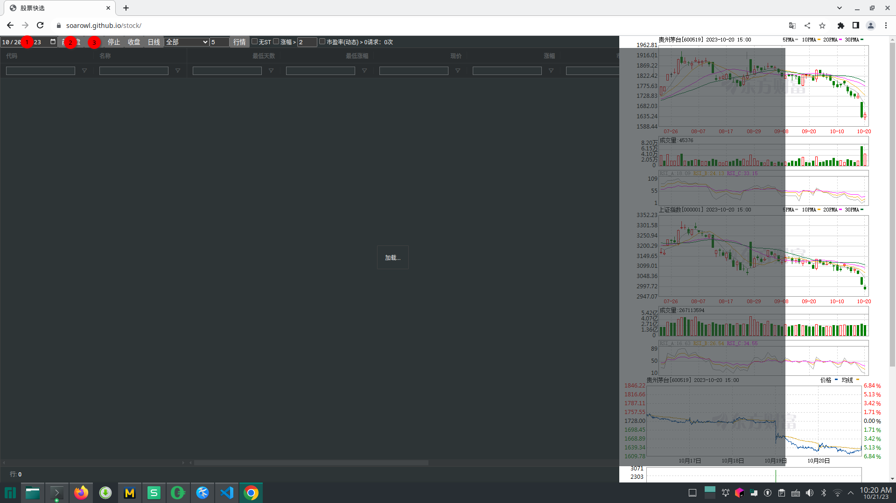

# 财经分析家

经过多年迭代开发，现免费开放，[欢迎大家使用](https://soarowl.github.io/stock/)，如果你觉得这个项目对你有帮助，请给个Star，谢谢！

## 操作简单

1. 在浏览器中输入`https://soarowl.github.io/stock/`进入网站
1. 确认上一交易日日期
1. 点击`前收盘`按钮获取上一交易日融资融券、估值数据
1. 点击`行情`获取当前行情数据
1. 开始愉快之旅

## 功能强大

1. 点击表头可快速对数据进行排序
1. 点击表头下方输入框右边的图标，可快速对数据进行筛选过滤
1. 数据自动刷新
1. 切换日线/月线
1. 对数据按某日交易结果过滤。例如：对于`2023-10-20+`，只显示`2023-10-20`的上涨的股票；对于`2023-10-20-`，只显示`2023-10-20`的下跌的股票；`关注[-2,2]`表示上一收盘日的涨跌幅在`[-2,2]`之间的股票。
1. 设置刷新间隔
1. 在行情|融资融券|估值列表之间切换
1. 快速显示`涨幅 > 2`的股票

## 打赏

如果你觉得这个项目对你有帮助，请捐助一杯咖啡吧!

 
